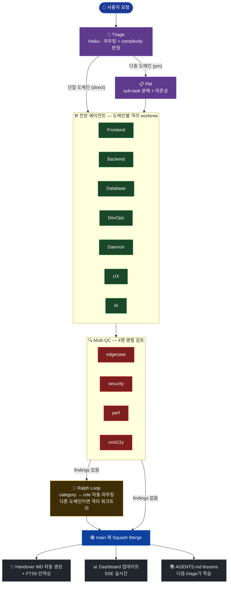

# agent-forge

**Claude 에이전트로 여러 명의 전문 개발자가 협업하는 자동 엔지니어링 시스템.** 자연어로 "X 추가해줘" 라고 던지면, 트리아지가 분류하고 PM이 분해하고 frontend/backend/database/devops/UX/AI 전문 에이전트가 각자 격리된 git worktree에서 작업하고, 4명의 QC가 병렬로 검토하고, 발견된 버그는 Ralph Loop가 자동 수정해서 main에 squash 머지까지 합니다.

> 빌드: TypeScript · Claude Agent SDK · Next.js 15 · node:sqlite · git worktree

---

## 동작 파이프라인



**모델 자동 선택**: Triage가 작업의 complexity 를 평가해 `simple/standard` → Sonnet 4.6, `complex` → Opus 4.7 로 자동 라우팅. Triage 자체는 항상 Haiku (저렴).

---

## 무엇을 할 수 있나 (예시)

| 사용자 입력 | 자동 처리 |
|---|---|
| "칸반 카드 마우스 호버 시 배경 살짝 밝게" | triage→frontend→QC×4→merge. ~$0.18 |
| "사용자 프로필 페이지 만들어줘" | triage→pm→database+backend+frontend (3 waves)→merge. ~$3 |
| "GitHub Actions CI 추가, push 마다 typecheck+build" | triage→devops→QC×4→merge. ~$1.5 |
| "tasks 테이블에 priority 컬럼 + 인덱스" | triage→database→QC×4→merge. ~$1.2 |

---

## 설치

### 사전 요구사항

| 항목 | 버전 | 설치 |
|---|---|---|
| **Node.js** | ≥ 20 | [nodejs.org](https://nodejs.org) 또는 `brew install node` |
| **Git** | ≥ 2.30 | macOS Xcode CLT / Linux `apt install git` |
| **Claude Code CLI** | 최신 | [docs.claude.com](https://docs.claude.com/claude-code) → `claude` 한 번 실행해 로그인 |

(macOS / Linux 권장. Windows는 WSL2)

### 방법 ① — 한 줄 설치 (권장)

```bash
curl -fsSL https://raw.githubusercontent.com/kiju7/agent-forge/main/install.sh | bash
```

이 한 줄이 다음을 자동 처리합니다:
- 사전 요구사항(Node·git·pnpm·claude) 점검
- 레포 클론 (`./agent-forge`)
- `pnpm install` + `pnpm migrate`
- 초기 커밋 (worktree 분기용)
- **`/forge` 슬래시 커맨드를 `~/.claude/commands/` 에 자동 설치** (경로 치환까지)

설치 위치를 바꾸려면:
```bash
curl -fsSL https://raw.githubusercontent.com/kiju7/agent-forge/main/install.sh | bash -s -- ~/code/agent-forge
```

설치 후:
```bash
claude        # 어느 디렉토리에서든
/forge        # 첫 실행 시 오케스트레이터·대시보드 자동 기동
```

### 방법 ② — 수동 단계 (스크립트가 안 통하는 환경)

<details>
<summary>펼치기</summary>

```bash
# 1) pnpm 활성화
corepack enable pnpm

# 2) Claude 인증 (한 번)
claude

# 3) 클론 + 설치
git clone https://github.com/kiju7/agent-forge.git
cd agent-forge
pnpm install
pnpm migrate

# 4) 초기 커밋이 없으면
git add -A && git commit -m "initial"

# 5) /forge 슬래시 커맨드 전역 등록 (경로 치환 포함)
mkdir -p ~/.claude/commands
sed "s|/Users/jd-kimkiju/Projects/agent-forge|$(pwd)|g" \
  .claude/commands/forge.md > ~/.claude/commands/forge.md
```

(Linux는 위 `sed` 그대로, macOS는 위 그대로 — `sed -i` 안 쓰니 OS 불문)

</details>

### 동작 확인

```bash
claude
# 안에서:
/forge
```

기대 동작:
1. 약 5초 안에 오케스트레이터+대시보드 자동 기동
2. "agent-forge ready · auto-tier · http://localhost:3000" 메시지
3. 브라우저로 <http://localhost:3000> 열면 빈 칸반 보드 보임

> **참고: npm 글로벌 설치는 아직 지원하지 않음.** 향후 `npm install -g @kiju7/agent-forge` 옵션 추가 예정. 현재는 한 줄 설치 스크립트가 사실상 동일 UX 입니다.

---

## 사용법

### 기본 흐름 — `/forge` 한 번 이후 자연어로

```
> /forge
agent-forge ready · auto-tier · http://localhost:3000
Describe your task; I'll classify, submit, and report.

> 칸반 카드 마우스 호버 시 배경 살짝 밝아지게
[classify] fix, complexity=simple
[submit]   request 01KRA...
[tail]     triage → in_progress → qc → done
[summary]  commit abc1234 · $0.18 · 0 findings (Sonnet)
```

### 인식되는 메타 명령 (자연어)

| 입력 (한/영) | 동작 |
|---|---|
| (그 외 모든 메시지) | 작업 분류 → 제출 → 추적 → 요약 |
| `status` / `상태` | 헬스 + 진행 중 태스크 + 누적 비용 + QC 리더보드 |
| `tail` / `이벤트` / `방금 뭐 했어` | 최근 30개 SSE 이벤트 표 |
| `stop` / `종료` / `꺼` | 두 서버 종료 |
| `last` / `마지막` / `최근 결과` | 마지막 완료 요청의 커밋·비용·decisions |
| `switch to opus` / `오푸스로` | 전부 Opus 강제 모드로 재시작 |
| `switch to sonnet` / `소넷으로` | auto-tier (Sonnet 기본)로 복귀 |
| `help` / `도움` | 메타 명령 리스트 |
| `exit` / `끝` / `bye` | 대화 모드 종료 (서버는 유지) |

### 대시보드 페이지 (`http://localhost:3000`)

| 라우트 | 내용 |
|---|---|
| `/` | 칸반 보드 — 모든 태스크 상태별, SSE 실시간 |
| `/new` | 요청 제출 폼 (자연어로 입력) |
| `/requests/[id]` | 요청 상세 + 자식 태스크 + 총 비용 |
| `/tasks/[id]` | 태스크 상세: 비용 내역 + QC findings + Ralph 이력 + 타임라인 |
| `/agents` | QC 리더보드 (sparkline) + 에이전트 목록 |
| `/decisions` | ADR-lite: triage/PM/Ralph 결정 rationale |
| `/handover` | 인수인계 문서 FTS5 검색 |

---

## 비용 가이드 (Claude API)

| 작업 규모 | 모델 | 호출당 비용 |
|---|---|---|
| 단일 파일 텍스트 변경 | Sonnet | $0.10–0.30 |
| 일반 기능 추가·버그 수정 | Sonnet | $0.50–2.00 |
| 다중 도메인 새 기능 (PM 거침) | Opus (auto-tier complex) | $3–10 |
| 대형 아키텍처 변경 | Opus 강제 | $5–20 |

**auto-tier (기본)** 가 작업 복잡도에 따라 Sonnet/Opus 를 자동 선택해요. 모든 호출이 `task_costs` 테이블에 기록되고 대시보드에서 실시간으로 보입니다.

비용 폭주 방지:
- 환경변수 `RALPH_FINDING_CAP=3` (기본) — Ralph가 처리할 finding 수 상한
- 대시보드 `/tasks/[id]` 에서 누적 비용 확인 → 이상하면 즉시 stop

---

## 디렉토리 구조 (요약)

```
agent-forge/
├── agents/              # 각 에이전트의 MD 정의 (1급 시민)
│   ├── triage.md
│   ├── pm/lead.md
│   ├── frontend/lead.md
│   ├── backend/lead.md
│   ├── database/lead.md
│   ├── devops/lead.md
│   ├── daemon/lead.md
│   ├── ux/lead.md
│   ├── ai/lead.md
│   └── qc/qc-{edgecase,security,perf,ux}.md
├── apps/
│   ├── orchestrator/    # Node 데몬: 트리아지·디스패치·worktree·Ralph
│   └── dashboard/       # Next.js: 칸반·결정·인수인계·리더보드
├── packages/
│   ├── shared/          # 타입·enums·zod 스키마
│   ├── db/              # SQLite 스키마·마이그레이션·쿼리
│   ├── agents/          # Claude Agent SDK 래퍼·MD 로더·hooks
│   └── qc-rewards/      # 점수 공식
├── docs/
│   ├── handover/        # 자동 생성된 인수인계 문서
│   └── adr/             # 아키텍처 결정 기록
├── data/                # 런타임 (gitignored)
│   ├── app.db
│   ├── events.ndjson
│   └── worktrees/
└── .claude/commands/forge.md   # 슬래시 커맨드
```

---

## 흔한 문제 해결

| 증상 | 해결 |
|---|---|
| `/forge` 인식 안 됨 | `ls ~/.claude/commands/forge.md` 확인. 없으면 위 6번 단계 다시 |
| `spawn node ENOENT` | 쉘에서 `corepack enable pnpm` 다시. claude를 그 쉘에서 재기동 |
| `git worktree add` 실패 | 초기 커밋 없음 → `git add -A && git commit -m init` |
| Claude 인증 오류 | 쉘에서 `claude` 한 번 실행해 OAuth 로그인 갱신 |
| 포트 충돌 (`4317`/`3000`) | 기존 프로세스 종료: `lsof -ti:4317 \| xargs kill` |
| DB 상태 이상 | `rm data/app.db* && pnpm migrate` (모든 데이터 초기화됨) |
| 대시보드 SSE 안 옴 | 오케스트레이터와 대시보드가 같은 워크스페이스 루트에서 실행됐는지 확인 |

---

## 환경변수

| 변수 | 기본 | 의미 |
|---|---|---|
| `AGENT_FORGE_MODEL` | (없음) | 모든 dev/QC 강제 모델 지정 — auto-tier 무시 |
| `AGENT_FORGE_TRIAGE_MODEL` | (없음) | Triage 강제 모델 |
| `AGENT_FORGE_AUTO_TIER` | `on` | `on`/`conservative` (complex만 Opus), `eager` (standard도 Opus), `off` (MD 디폴트) |
| `RALPH_FINDING_CAP` | `3` | Ralph가 처리할 finding 상한 (비용 보호) |
| `ORCHESTRATOR_PORT` | `4317` | 오케스트레이터 HTTP 포트 |
| `AGENT_FORGE_DB` | `data/app.db` | DB 경로 |
| `AGENT_FORGE_EVENTS` | `data/events.ndjson` | SSE 이벤트 파일 경로 |

---

## 추가 정보

- **아키텍처 상세**: `docs/adr/0001-architecture.md`
- **에이전트별 가이드라인**: `agents/<role>/<name>.md` 직접 열람
- **수정 이력**: `git log --oneline`
- **이슈/제안**: GitHub 레포에 이슈 등록
