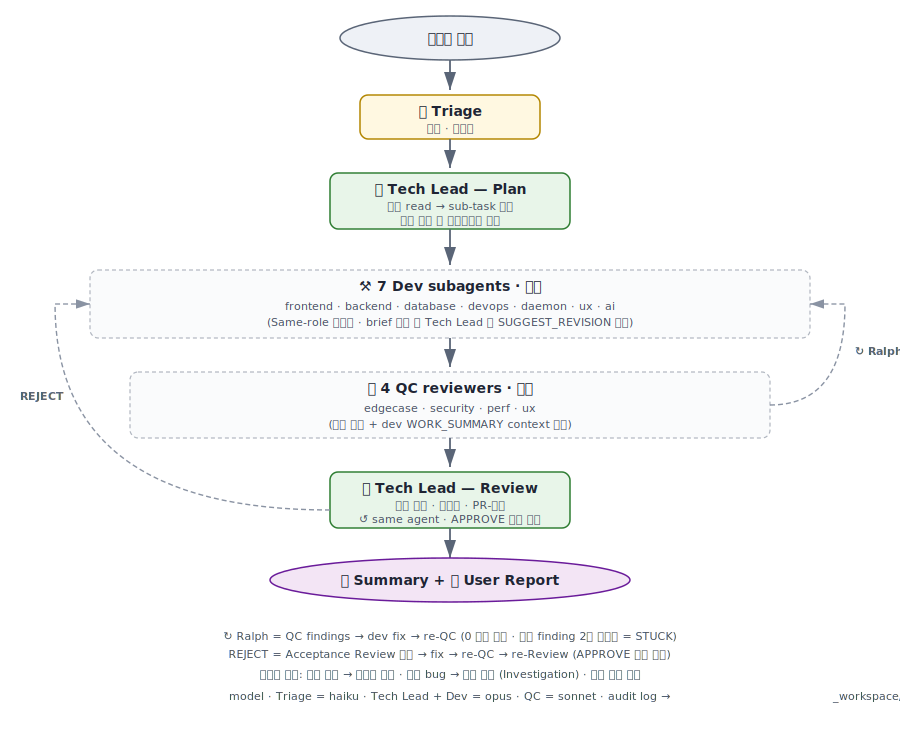

# dfx

> Claude Code 안에서 **다중 전문 에이전트가 협업하는 엔지니어링 파이프라인**.
> `/dfx:run "X 해줘"` 한 번이면 — 분류 · 계획 · 구현 · 검증 · 리뷰가 자동으로 흘러갑니다.

100% 네이티브 — Claude Code 의 `Task` subagent 만 사용. 외부 서버·DB·대시보드 없음.

---



## 핵심 기능

- 🎯 **Triage** — 요청 분류, 어디로 보낼지 결정
- 📋 **Tech Lead** — 코드를 직접 읽고 sub-task 분해. 의도 모호하면 사용자에게 묻고, 모호 bug 면 dev/QC 에게 재현 시도 발주
- ⚒️ **7 Dev (병렬)** — frontend / backend / database / devops / daemon / ux / ai
- 🔍 **4 QC (병렬)** — edgecase / security / perf / ux. 의도 context 받음
- ↻ **Ralph 수렴** — findings 0 까지 자동 fix
- 🔎 **Acceptance Review** — Tech Lead 가 최종 검토. 의도 충족 / 일관성 / 품질
- 🧪 **검증 방식 선택** — Playwright e2e / 단위 테스트 / 수동 중 사용자에게 옵션 제시
- 📄 **사용자 보고서** — 비전문가용 markdown 자동 생성
- 📁 **Audit log** — `_workspace/<run-id>/` 영구 기록

---

## 설치

```
/plugin marketplace add kiju7/dfx
/plugin install dfx@kiju7-dfx
```

또는 `/plugin` GUI → **Discover** 탭 → `dfx` → Install.

## 사용

```
/dfx:run "<your engineering request>"
```

> 플러그인 커맨드는 `/<플러그인>:<커맨드>` 로 네임스페이싱됩니다 → `dfx` 플러그인의 `run` 커맨드 = `/dfx:run`.

예시:

| 요청 | 자동 처리 |
|---|---|
| `"칸반 카드 hover 시 배경 살짝 밝게"` | frontend → QC → APPROVE → 요약 |
| `"사용자 프로필 페이지 만들어줘"` | Tech Lead → (db + backend + frontend 병렬) → QC → Review → 요약 |
| `"결제 화면 가끔 카드 마지막 자리 잘림"` | Tech Lead → 자동 재현 → 가설 확정 → fix → 검증 |
| `"shm 비활성화하고 remote triton 으로"` | Tech Lead 가 "toggle vs 삭제" 사용자에게 문의 → 답대로 진행 |

`🎯 Triage → ... → 🏁 done` 식 한 줄씩 떨어지며, 마지막에 **사용자 보고서** (비전문가용 markdown) 가 함께 출력됩니다.

> ⚠️ 같은 worktree 에서 `/dfx:run` 두 번 동시 실행 금지 — git index race · build artifact 충돌. 두 작업을 동시에 돌리려면 `git worktree add` 로 격리하세요.

---

<details>
<summary><b>📝 잘 부르는 요령</b></summary>

- **명확한 도메인 단어** 1~2 개 포함 → 정확도 ↑
  - 좋음: `"globals.css 에 hover 효과 추가"`, `"tasks 테이블 priority 컬럼 추가"`
  - 약함: `"좀 더 예쁘게"`, `"성능 좋게"`
- **목표를 한 문장**으로 — 긴 명세는 Tech Lead 가 분해해주니까 줄거리만
- **다중 도메인**은 한 호출로 OK — Tech Lead 가 코드 보고 알아서 쪼갬
- **모호한 bug 도 OK** — "가끔 X 가 안 됨" 같은 재현 정보 부족 요청도 dev/QC 가 자동 재현 시도 (v0.11+)
- **검증 방식 미리 지정 가능** — `"Playwright 로 검증해줘"`, `"수동 확인할 거니까 검증 코드 X"` 라고 적으면 그대로 따름

</details>

<details>
<summary><b>📤 출력 형식 예시</b></summary>

#### 단순 케이스 (clean 직진)

```
📁 Audit log — _workspace/20260512-153022-a3f4/
🎯 Triage — fix · route=direct · targets=frontend
📋 Plan — 1 subtasks
  · [frontend] globals.css hover 변경
✅ Layer 0 — 1/1 done
🔍 QC — total 0 findings
🔎 Review — APPROVE · intent_match=yes
🏁 dfx done

📄 사용자 보고서
# 작업 요약
칸반 카드에 마우스 hover 시 배경이 살짝 밝아지도록 추가.
...
```

#### 모호한 bug 케이스

```
🎯 Triage — bug · route=lead
🔬 Investigation — 재현 시도 (가설: input maxLength / 응답 truncation)
🔬 Investigation round 1 — 3 repro tasks 병렬
🔬 Investigation result — 재현 1 / 안됨 2
📋 Plan — 1 subtasks  (qc-edgecase 가 19자리 AMEX 에서 재현 성공)
...
```

#### 의도 모호 케이스

```
🤔 확인 필요 [Tech Lead Mode 2]
코드 분석: EnableShm bool 토글, 2 군데서 분기...
  A. EnableShm=false 로 토글 (코드 유지)
  B. SHM 관련 코드 자체 제거
추천: A. 어떻게 갈까?

[사용자: A]
📋 Plan — ...
```

</details>

<details>
<summary><b>📁 Audit log 구조</b></summary>

매 /dfx:run 호출은 `_workspace/<run-id>/` 에 단계별 기록 남김:

```
_workspace/20260512-153022-a3f4/
  00-request.md          # 원본 요청
  01-triage.json         # triage 출력
  02-plan.json           # Tech Lead 분해 결과 raw
  02-plan.md             # 사람용 markdown mirror
  02b-investigation/     # (조건부) 재현 보고서
  03-impl/layer-0/
    frontend-1.md        # brief + WORK_SUMMARY
  04-qc/iter-0.json      # QC findings
  05-ralph/iter-1.md     # fix dispatch + 결과
  06-review/round-1.json # Acceptance Review verdict
  97-user-report.md      # 사용자 보고서 (Tech Lead 작성)
  99-summary.md          # 기술 요약
```

`.gitignore` 가 `_workspace/` 무시. 디스크 사용 미미 (run 당 ~수십 KB).

용도: audit / debug / chat context 휘발 후 회수 / 팀 review.

</details>

<details>
<summary><b>💰 비용 가이드</b></summary>

| 작업 규모 | 모델 분포 | 1 회 비용 추정 |
|---|---|---|
| 단순 fix (한 파일) | Triage(Haiku) + dev(Opus) + QC×4(Sonnet) + Review(Fable) | $0.50–2.00 |
| 일반 기능 / 버그 | + Tech Lead(Fable, 코드 read) + Ralph 1~2 iter | $2–10 |
| 다중 도메인 신규 기능 | dev 여러 개 병렬 + QC×4 + Ralph 2~5 iter + Review | $8–35 |
| 모호 bug (Investigation 활성) | + 재현 라운드 1~2 | 위 + $1–5 |

기본 티어: triage = haiku · QC×4 = sonnet · **Tech Lead = fable** · Dev = opus. 단, Tech Lead 가 sub-task 마다 난이도 tier(`standard|deep`) 를 판정해 `deep` 인 것만 dev 를 fable 로 올림 (그 외 opus).

비용 줄이려면: dev 의 `model: opus` → `sonnet` 다운그레이드, QC 4 중 일부 제외, 또는 Tech Lead 가 `deep` tier 를 더 보수적으로 쓰도록 (`agents/lead.md` tier 기준 조정).

</details>

<details>
<summary><b>🛠 커스터마이즈</b></summary>

### 새 전문 에이전트 추가

```bash
# agents/security-auditor.md
---
name: security-auditor
description: 보안 감사 전문
model: sonnet
tools: [Read, Grep, Glob, Bash]
---
당신의 역할은...
```

`skills/dfx/SKILL.md` 의 라우팅에 추가하면 끝.

### 모델 변경

각 `agents/<name>.md` 의 `model:` 필드. 옵션: `haiku | sonnet | opus | fable`. (현재 Tech Lead = `fable`, Dev = `opus` 기본 — 단 Tech Lead 가 sub-task 마다 tier `standard|deep` 로 dispatch 시 opus/fable 을 per-call 선택.)

### 디렉토리 구조

```
dfx/
├── .claude-plugin/
│   ├── plugin.json
│   └── marketplace.json
├── commands/run.md         # /dfx:run 슬래시 커맨드
├── skills/dfx/SKILL.md     # 파이프라인 오케스트레이션
└── agents/                   # 13 subagents
    ├── triage.md / lead.md
    ├── frontend / backend / database / devops / daemon / ux / ai
    └── qc-{edgecase,security,perf,ux}
```

</details>

<details>
<summary><b>⚙️ 동작 원리</b></summary>

1. `/dfx:run` = `commands/run.md` → `dfx` skill 호출
2. Claude Code 가 `skills/dfx/SKILL.md` 를 시스템 프롬프트에 합쳐 본 어시스턴트가 오케스트레이터 역할
3. 본 어시스턴트가 `Task(subagent_type: "...")` 호출로 13 개 subagent (`agents/*.md`) 를 격리 컨텍스트에서 실행
4. 같은 메시지에 여러 Task 호출 = 병렬 / 다음 메시지 = 순차

Claude Code 의 [Task subagent 기능](https://docs.claude.com/en/docs/claude-code/sub-agents) 를 그대로 씀 — 추가 인프라 0.

</details>

<details>
<summary><b>📦 수동 설치 (오프라인 / 마켓플레이스 우회)</b></summary>

```bash
git clone https://github.com/kiju7/dfx.git /tmp/dfx
mkdir -p ~/.claude/{commands,agents,skills}
cp    /tmp/dfx/commands/run.md ~/.claude/commands/
cp -r /tmp/dfx/agents/*          ~/.claude/agents/
cp -r /tmp/dfx/skills/dfx      ~/.claude/skills/
rm -rf /tmp/dfx
```

> 개인 설치(`~/.claude/commands/`)는 플러그인이 아니라 네임스페이스가 안 붙으므로 `/run` 으로 호출됩니다. `/dfx` 로 쓰고 싶으면 복사 시 파일명을 바꾸세요: `cp /tmp/dfx/commands/run.md ~/.claude/commands/dfx.md`.

</details>

---

- **레포** · <https://github.com/kiju7/dfx>
- **이슈** · GitHub Issues
